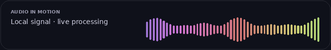

<p align="center">
  
</p>

<p align="center">
  <strong>A private, local-first desktop workspace for speech and audio.</strong><br>
  Record · transcribe · translate · narrate · dub · fine-tune pitch
</p>

<p align="center">
  
</p>

<p align="center">
  <a href="LICENSE"></a>
  
  
  
</p>

> **VoiceStudio is a free, open-source starter desktop app.** It does not require an account, API key, subscription, or hosted voice service. Inference happens on your machine when you configure compatible local engines. Optional model and package licenses are separate—check them before use.

## What it does

VoiceStudio combines a polished Electron desktop interface with an optional Python bridge. The UI and local file workflows work without a model pack; machine-learning tasks become available when you select compatible local packages and model files.

| Workflow                                         | Included in this repository                                                                            | Local requirements                                                                                                                            |
| ------------------------------------------------ | ------------------------------------------------------------------------------------------------------ | --------------------------------------------------------------------------------------------------------------------------------------------- |
| **Voice gallery / consented reference profiles** | Record or import a sample; create, tag and manage local profiles                                       | No model needed to save a profile; XTTS is needed to synthesize from a reference                                                              |
| **Voice description**                            | Save age range, voice presentation, accent, emotion and notes as profile metadata                      | Description-to-new-voice synthesis is not implemented in this build; a compatible local voice-design model and future adapter would be needed |
| **Dictation**                                    | In-app recorder and floating always-on-top mini widget; copy the transcript and paste into another app | Local faster-whisper model and Python package                                                                                                 |
| **Transcribe audio/video**                       | Local transcription, transcript view and subtitle (`.srt`) output                                      | Local faster-whisper model; media decoding support                                                                                            |
| **Translate**                                    | Translate transcripts or extracted document text                                                       | Argos Translate plus the relevant language pack, already installed locally                                                                    |
| **Document to audiobook**                        | Read TXT, Markdown, selectable-text PDF and DOCX; split narration into chunks; save WAV                | Piper voice model or local XTTS model; `pypdf`/PyMuPDF for PDF; `python-docx` for DOCX                                                        |
| **Video dubbing**                                | Transcribe, optionally translate, synthesize timed lines and write a new media file                    | faster-whisper, XTTS with a consented reference, local Argos pack when translating, and ffmpeg                                                |
| **Pitch & audio**                                | Built-in WAV export with **4,801 pitch positions**: −24 to +24 semitones in 0.01-semitone steps        | No ML model; basic local resampling changes duration as well as pitch                                                                         |
| **Appearance & jobs**                            | Dark/light themes, local hardware preference, progress, job history and exports                        | None                                                                                                                                          |

### Honest boundaries

- A profile made from a description is **metadata**, not a trained voice. Piper uses the selected Piper voice; reference-based synthesis uses the configured XTTS model and sample. There is no from-scratch voice-design model bundled here.
- Voice similarity is approximate. **No app can guarantee a 100% identical reproduction of any person.** Only use a voice you own or have explicit permission to reproduce; disclose synthetic speech when listeners could be misled.
- Dubbing timing is approximate. This first implementation creates a generated speech track and **mutes the original source audio**; it does not separate speakers/background ambience, perform studio mastering, or lip-sync faces.
- Pitch shifting is simple resampling. Higher/lower pitch also changes duration; this is not formant-preserving conversion or a professional time-stretch engine.
- PDF extraction reads selectable text only. Scanned/image-only pages need a separate local OCR step before import.
- The dictation widget floats above other apps and copies text to the clipboard. Paste it yourself; VoiceStudio does not inject keystrokes into other applications.

## Privacy model

<p align="center">
  
</p>

- No accounts, API-key fields, analytics SDK, telemetry endpoint, CDN dependency, or remote inference route.
- The renderer blocks network connections with a Content Security Policy. Model loading is local-only and configured by file/folder paths.
- VoiceStudio never downloads packages or weights automatically. You choose whether and how to install optional runtimes and models.
- Imports, voice references, app settings and generated outputs stay in the operating system's VoiceStudio data folder. Use **Settings → Privacy & data → Open VoiceStudio data folder** to inspect it.
- During setup, `npm install`, `pip`, operating-system package managers, and model hosts may use the internet if you choose to run them. For a strict air-gapped workflow, obtain and verify installers/models separately, then disconnect before processing.

See [SECURITY.md](SECURITY.md) for the threat model and [runtime/README.md](runtime/README.md) for engine setup.

## Run the desktop app

### Requirements

- Windows, macOS or Linux desktop with a supported 64-bit Electron runtime.
- Node.js and npm for the first install.
- Optional Python 3 for local inference. Models are not bundled; storage, memory, CPU/GPU and model license terms depend on the model you select.

### Install and launch

```bash
git clone https://github.com/Muhammad112233-creator/voicestudio-1.git
cd voicestudio-local
npm install
npm start
```

`npm install` installs Electron for the desktop shell. The app does not need a service account or API key. After install, the UI itself has no network client. To configure speech engines, open **Settings & engines** and point to local packages, executable(s), and model directories.

### Browser preview (UI only)

For a quick look at the interface without Electron:

```bash
npm run preview
```

Open `http://localhost:4173`. The browser preview has no Electron file dialogs, local Python runner, or floating-widget shortcut; it is for UI review only. For actual processing, launch the desktop app.

## Set up optional local engines

VoiceStudio intentionally does **not** install model weights. The full walkthrough, offline setup notes and model path expectations are in **[runtime/README.md](runtime/README.md)**. Typical optional pieces are:

- **faster-whisper** + a local CTranslate2 model folder — transcription and dictation.
- **Piper** + a local `.onnx` voice — general local speech synthesis.
- **Coqui TTS / XTTS** + a local checkpoint/config and an authorized reference recording — reference-conditioned synthesis and dubbing.
- **Argos Translate** + locally installed language packages — offline translation.
- **ffmpeg** — media muxing for dubbing.
- **pypdf** or **PyMuPDF**, and **python-docx** — local document text extraction.

Install packages into the same Python environment you select in Settings. Select actual local paths; do not give VoiceStudio a model name that would trigger a remote model lookup. The bridge fails closed if faster-whisper lacks support for `local_files_only`.

## Dictation widget

1. Start VoiceStudio and configure a local Whisper model in Settings.
2. Press **Ctrl + Shift + Space** (Windows/Linux) or **⌘ + Shift + Space** (macOS), or click the small `⌁` button in the top bar.
3. Record, stop, wait for the local transcript, then select **Copy text**.
4. Switch to your other application and paste.

The widget is an always-on-top window. The global shortcut may be unavailable if another app or the OS already owns it; in that case, use the top-bar button. VoiceStudio requests microphone access only when you choose to record.

## Run the local bridge directly

The Electron app calls `runtime/engine_bridge.py` with one JSON request on stdin. The bridge emits progress/result JSON lines on stdout. It has no network client and supports these actions: `probe`, `transcribe`, `translate`, `extract_document`, `tts`, `audiobook` and `dub`.

Quick syntax checks:

```bash
node --check main.cjs
node --check preload.cjs
node --check renderer.js
node --check widget.js
python -m py_compile runtime/engine_bridge.py
python -m unittest discover -s runtime -p 'test_*.py'
```

## Repository layout

```text
VoiceStudio/
├── index.html, styles.css, renderer.js    # Main desktop UI
├── main.cjs, preload.cjs                  # Electron shell and narrow local IPC bridge
├── widget.html, widget.css, widget.js     # Floating local dictation widget
├── preview.cjs                             # Lightweight UI-only preview server
├── runtime/engine_bridge.py                # Optional offline inference adapters
├── runtime/README.md                       # Local model/package setup
├── runtime/test_engine_bridge.py           # Dependency-free bridge utility tests
├── docs/ARCHITECTURE.md                    # Process, file and engine boundaries
├── docs/GITHUB_PUBLISH_GUIDE.md            # Drag-and-drop GitHub publishing guide
├── assets/*.gif                            # Local animated README artwork
├── SECURITY.md, LICENSE
└── .gitignore, .gitattributes
```

## Contributing

Issues and pull requests are welcome. Keep the offline contract intact: no analytics, remote model fallback, or silent package/model downloads. Please do not attach private voice samples, model weights, generated impersonations, or credentials to issues. Read [SECURITY.md](SECURITY.md) before reporting a vulnerability.

## License

The VoiceStudio source and original UI artwork are released under the [MIT License](LICENSE). Third-party runtimes, models and weights remain under their own licenses; MIT does not grant rights to those assets.

<div align="center">
## ⭐ Support the Project

If you found this tool helpful, please consider giving it a **star**! It helps others discover the project and keeps the maintainers motivated.

[](https://github.com)

</div>
